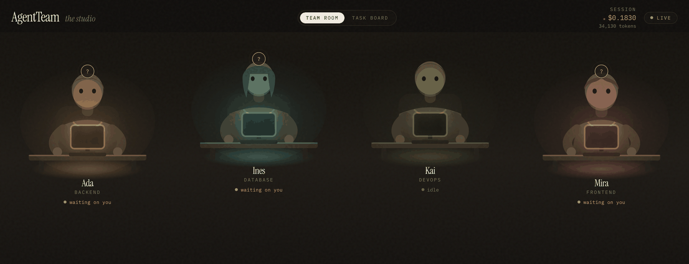
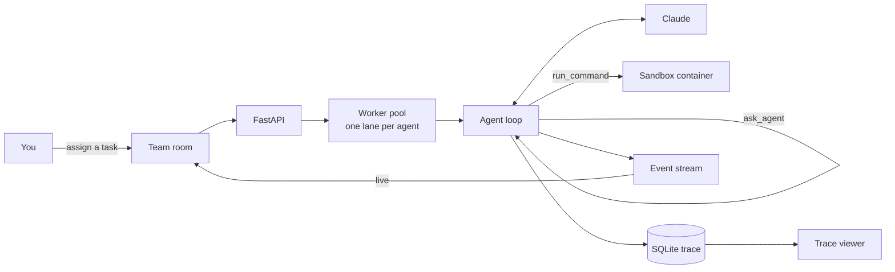

# AgentTeam

[](https://github.com/singha105/agent-team/actions/workflows/ci.yml)

**A simulated software engineering team of AI agents. You are the manager; the agents are the team.**

Four agents sit at lit desks in a dark studio. Give one a task and watch it work —
and when it needs something it does not own, watch it ask a teammate and build on
the answer, without you.



> **Recording the screenshot above**
>
> ```bash
> python scripts/demo_server.py --seed        # terminal 1
> cd frontend && npm run dev                  # terminal 2
> ```
>
> Open `http://localhost:5173` and wait a few seconds for the agents to start
> delegating. Capture at 1440×900 with a bubble mid-flight — that frame carries
> the whole idea. Save to `docs/media/team-room.png`.
>
> For a GIF, `⌘⇧5` on macOS records a region; keep it under 8 seconds and around
> 3 MB, and start recording just before the first bubble leaves a desk.

---

## The problem

Multi-agent demos usually show you a transcript. A wall of text scrolls past, some
of it is tool calls, and you have no idea what it cost, whether the agents actually
talked to each other, or what would happen if one of them looped forever.

AgentTeam is the opposite bet: **make the whole thing observable, bounded and
reconstructable.**

- **Observable** — status is legible as light in a room, not as a log line. Every
  message, tool call and token lands in SQLite and streams live over a WebSocket.
- **Bounded** — iterations, tokens, delegation hops, cycles and a wall clock all
  have ceilings, and every one names the limit it tripped.
- **Reconstructable** — any run replays from the database alone: every step in
  order, every tool argument and result, every delegated child, every cent.

---

## Quickstart

**One command, from a clean clone:**

```bash
git clone https://github.com/singha105/agent-team.git && cd agent-team
cp .env.example .env          # then put your ANTHROPIC_API_KEY in it
docker compose up --build
```

Open **http://localhost:8080**.

**No API key? Node is all you need.** `npm run demo` replays a recording of a real
run — the actual event stream and the actual REST responses — with no backend at all:

```bash
cd frontend && npm install && npm run demo    # → localhost:5173
```

Watch the agents delegate, the bubbles cross the room and the cost meter climb.
Assigning and reviewing are disabled, and the app says so.

**Want a live backend without a key?** A scripted team, but everything else real —
real worker pool, real delegation, real sandbox, real trace:

```bash
python scripts/demo_server.py --seed          # terminal 1
cd frontend && npm run dev                    # terminal 2
```

**From the terminal instead:**

```bash
python -m app.cli run --agent backend --task "Build a REST API for a book library with search"
python -m app.cli show --task 1     # the full trace
python -m app.cli agents            # the roster
python -m app.cli preflight         # verify the live API for ~$0.01
```

---

## How it works



Full detail, with the loop, the buses, the sandbox and the budget system:
**[docs/ARCHITECTURE.md](docs/ARCHITECTURE.md)**.

---

## The team

| Agent | Name | Model | Owns |
|---|---|---|---|
| Backend | Ada | `claude-opus-5` | Endpoints, business rules, auth, service layer |
| DevOps | Kai | `claude-opus-5` | Containers, CI/CD, env config, deployment, monitoring |
| Frontend | Mira | `claude-sonnet-5` | Components, client state, styling, accessibility |
| Database | Ines | `claude-sonnet-5` | Schema, migrations, indexes, query performance |

A second roster ships too — a three-agent research team — as proof the runtime is
generic. `AGENTTEAM_TEAM=research` and it runs, with no code change:
**[docs/CREATING_A_TEAM.md](docs/CREATING_A_TEAM.md)**.

---

## Design decisions

### Why agents are configuration, not code

An agent is one YAML file. Name, role, model, system prompt, tool grants, budget
overrides — all of it data. `runtime.py` contains no knowledge of any specific
agent.

The test is uncomfortable but fair: *if adding an agent requires touching Python,
the claim is false.* So the repo ships a second team of a different size with
different roles, and a test builds a one-agent team from scratch in a temp
directory and runs it.

This also makes the expensive knob cheap. Changing a model is one line:

```yaml
model: claude-haiku-4-5    # was claude-opus-5
```

### Why those model assignments, and what it costs

| | Model | Rate (in/out per MTok) | Reasoning |
|---|---|---|---|
| Backend, DevOps | `claude-opus-5` | $5 / $25 | These two make decisions others build on. A wrong API contract or a broken pipeline propagates; the whole team then builds on it. |
| Frontend, Database | `claude-sonnet-5` | $2 / $10 | Both work against a contract someone else published. The task is well-specified by the time it reaches them, which is exactly where a cheaper model holds up. |

Measured on the book-library task with a live delegation, that mix costs roughly
**$0.20–0.50 a run**. All four on Sonnet is about a third of that and noticeably
worse at the contract-design step — the failure mode is a plausible-looking API
that the frontend then cannot implement. All four on Haiku is around **$0.03** and
struggles with the tool-use loop itself.

The point is that this is a **config decision, not an architecture decision**. You
can move the whole roster down a tier for development and back up for a real run
without touching code.

### Why delegation is bounded by a *tree*, not a run

Every limit — hops, cycles, the wall clock — belongs to the whole delegation tree.

A per-run hop counter lets every new child reset the budget, so the limit means
nothing. Per-run timeouts multiply: ten nested runs at 60s each is a ten-minute
stall, not a one-minute one. And cycle detection refuses a target already in the
chain, because that agent is *blocked waiting on this very call* — asking it would
deadlock, and it catches A→B→A one hop before it becomes a ping-pong.

The limits survive the queue too. A woken notification or a re-queued rejection
has no live parent to inherit from, so the budget is rebuilt from the database:
hops counted from the messages already in the tree, the chain from task ancestry,
the deadline from the root task's creation.

A refusal comes back to the agent as a **tool error it can work around**, not an
exception that kills the run.

### Why the sandbox allow-list is not the security boundary

The allow-list contains `python`, `pip`, `npm` and `git`. Each of those
independently grants arbitrary code execution — `python -c "import os;
os.system(...)"` escapes in one command.

So the boundary is a **disposable container**: `--network=none`, read-only root
filesystem, dropped capabilities, memory and PID limits, the workspace as the only
writable mount, killed by name on timeout. The allow-list is defence in depth and
a guard against accidents.

Verified against a running daemon, not assumed: host filesystem unreachable,
egress fails with `ENETUNREACH`, writes to `/` rejected, a 60s sleep killed at the
5s timeout with no container left behind.

### Why status is light

The room is dark and every desk is a pool of monitor light. That is not styling —
screen brightness is the *primary* carrier of status, so four agents can be read
at a glance without reading a single label. Posture is the second reading, the
mark above the head the third.

Characters are layered SVG built in code: no sprite sheets, no stock art. An
agent the UI has never seen gets a coherent desk from a hash of its key.

---

## What is verified, and what is not

| | |
|---|---|
| 353 backend + 68 frontend tests | green on Python 3.11/3.12/3.13 |
| Sandbox isolation | checked against a real Docker daemon |
| The live API path | **verified** — a real call, accepted, parsed |
| `docker compose up` | brought up and checked healthy from a clean clone |

Most tests run without an API key: the model is scripted, and a contract suite
drives the real Anthropic SDK over real HTTP against a local server speaking the
Messages API wire format. That proves the request shape without spending anything.

Only a live call proves Anthropic accepts it, and one command does that:

```bash
python -m app.cli preflight --model claude-haiku-4-5 --effort off   # ~$0.002
```

---

## Layout

```
backend/app/
  agents/     runtime, message bus, delegation, sandbox, tools
  api/        REST + WebSocket
  events/     typed event schemas and the fan-out bus
  models/     SQLAlchemy models
  workers/    the per-agent task queue
config/
  teams/      one directory per roster
  pricing.yaml
frontend/src/
  components/agent/   the characters and their state machine
  scenes/             team room, task board
  store/              Zustand + the pure event reducer
docker/       sandbox image, API image, web image, nginx
docs/         ARCHITECTURE, CREATING_A_TEAM, BUILD_LOG
```

---

## Development

```bash
python -m venv .venv && source .venv/bin/activate && pip install -e ".[dev]"
pytest                       # unit tests, no Docker needed
pytest -m integration        # container tests, needs a daemon
ruff check . && black --check . && mypy

cd frontend && npm install
npm test && npm run typecheck && npm run lint
```

CI runs all of it on every push, plus building all three images and checking the
API image reports healthy.

---

## Configuration

Every setting, with defaults and what it does, is documented in
[`.env.example`](.env.example). The ones worth knowing:

| Variable | Default | |
|---|---|---|
| `ANTHROPIC_API_KEY` | — | Required for live runs. Read from the environment only, never logged. |
| `AGENTTEAM_TEAM` | `software` | Which roster to run. |
| `AGENTTEAM_SANDBOX_MODE` | `docker` | `subprocess` runs on the host — **not** a security boundary. |
| `AGENTTEAM_MAX_AGENT_HOPS` | `10` | Delegation hops per tree. |
| `AGENTTEAM_TASK_DEADLINE_SECONDS` | `600` | Wall clock per tree. |
| `AGENTTEAM_WAKE_ON_NOTIFY` | `true` | Whether `send_message` queues work for the recipient. |

## Author

**Arnab Singh** — M.S. Computer Science, University of Dayton (Dec 2026).
Building toward DevOps, Cloud/AWS and AI Engineering.

[GitHub profile](https://github.com/singha105) ·
[Portfolio](https://singha105.github.io) ·
[LinkedIn](https://www.linkedin.com/in/singharnab/) ·
[arnabsingh001@gmail.com](mailto:arnabsingh001@gmail.com)
