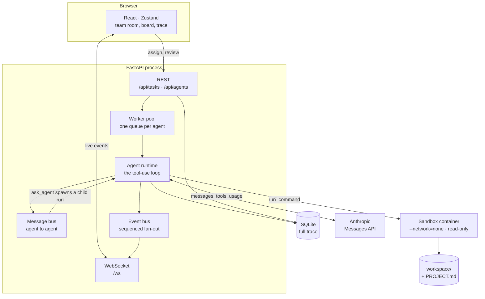
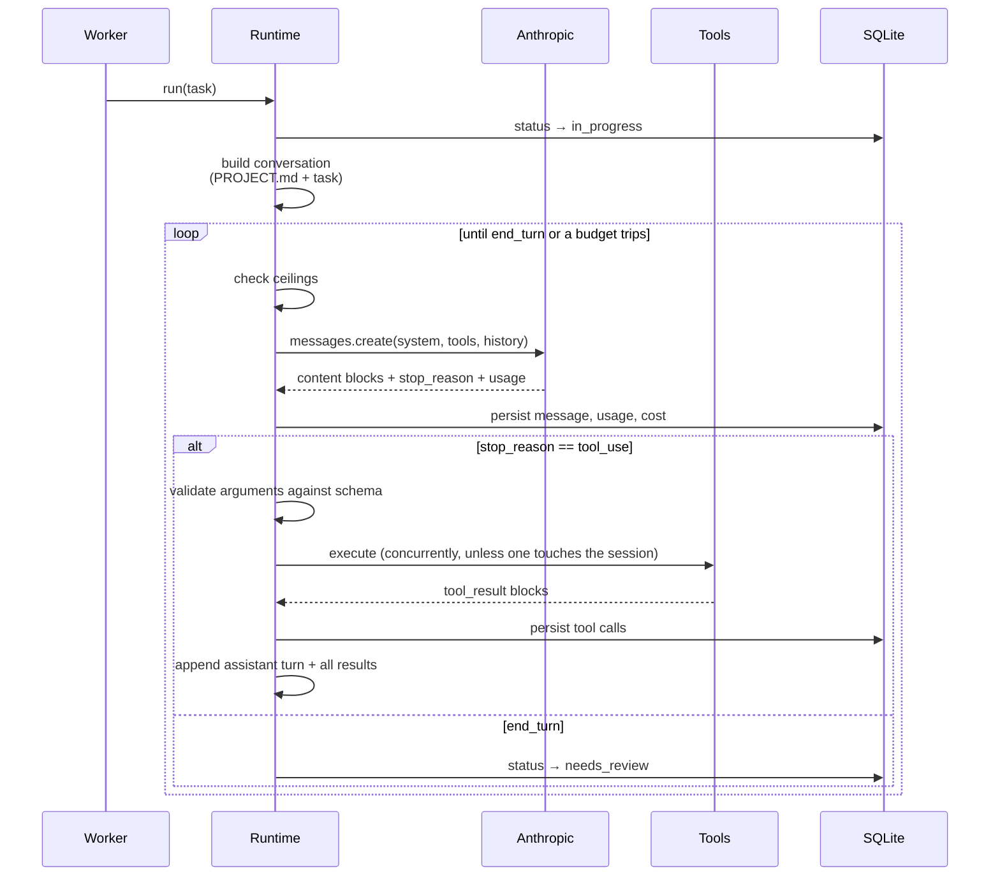
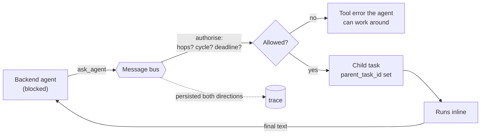
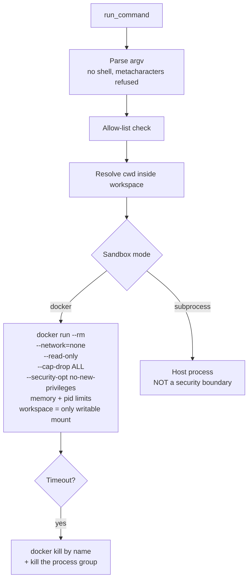
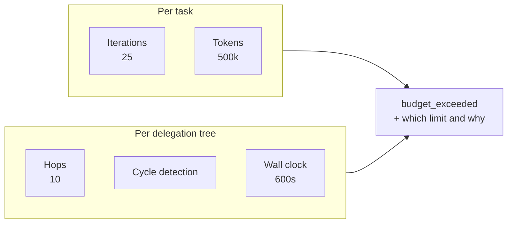
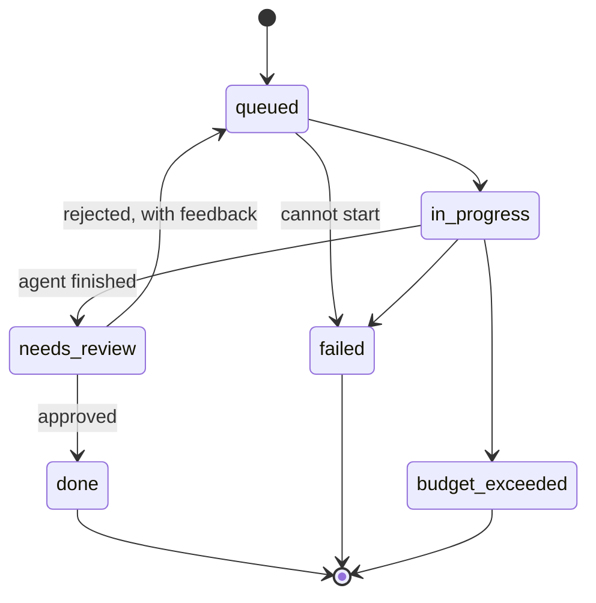

# Architecture

How AgentTeam actually works: the agent loop, the message bus, the sandbox, and
the budget system. Written for someone deciding whether the design is sound, not
for someone looking up a function signature.

---

## The shape of it

Two buses, deliberately separate and easy to confuse:

- **Event bus** (`app/events/bus.py`) — fans typed events out to WebSocket
  subscribers. It tells the UI what happened.
- **Message bus** (`app/agents/bus.py`) — routes messages *between agents* and
  can start work. It moves work around the team.

---

## The agent loop

One generic class runs any agent. Nothing in `runtime.py` knows about a specific
agent; identity is entirely YAML.

### Why a manual loop rather than the SDK's tool runner

The runner drives the loop for you, but it does not expose the two things this
project needs at every step: **persisting each step as it happens**, and
**checking budgets between iterations**. A trace that only appears after the run
finishes cannot drive a live UI, and a ceiling that is only checked at the end is
not a ceiling.

### Why every step is committed, not flushed

SQLite permits one writer. Holding a transaction open for an entire agent run
blocked every other agent — four agents took 1.10s to do four 0.2s tasks, fully
serial, and the worker pool's concurrency was fictional. Committing at each
persistence point fixed that, and gave two things for free: the trace is visible
*during* a run, and a crash leaves the record of what happened rather than
rolling it away.

### stop_reason handling

| `stop_reason` | What the loop does |
|---|---|
| `end_turn`, `stop_sequence` | Task → `needs_review`. The work is done; the manager owes a decision. |
| `tool_use` | Execute, append results, continue. |
| `pause_turn` | Resend to continue, capped at 5 resumes. |
| `max_tokens` | Fail with a reason — the output was truncated mid-thought. |
| `refusal` | Fail with the category from `stop_details`. |

`thinking` is deliberately never sent. Current models run adaptive by default,
and an explicit config would break the moment a different model is set in YAML —
which would contradict the one-line-model-change requirement.

---

## The message bus

**`ask_agent`** blocks: a child task is created, linked by `parent_task_id`, run
to completion, and its answer returns as the caller's tool result.

**`send_message`** does not block, but is not inert — the recipient is woken with
a queued follow-up task, so a notification reaches an idle teammate instead of
sitting unread.

### Why children run inline rather than through the queue

The caller is blocked either way, and queuing risks a deadlock: the target's lane
may already hold a task that is itself waiting on this one. Inline execution also
shares the caller's session, which is safe because the two runs are strictly
sequential.

### Loop protection

Three limits, all belonging to the **tree** rather than to any single run:

| Limit | Default | Why tree-wide |
|---|---|---|
| Hops | 10 | A per-run counter lets every new child reset the budget, so the limit means nothing. |
| Cycle detection | — | A target already in the chain is *waiting on this very call*; asking it would deadlock. Catches A→B→A one hop before it becomes a ping-pong. |
| Wall clock | 600s | Per-run timeouts multiply: ten nested runs at 60s each is a ten-minute stall. |

The limits are also **durable**. A task the worker picks up later — a woken
notification, a re-queued rejection — has no live parent to inherit from, so
`restore_context` rebuilds the budget from the database: hops counted from the
agent-to-agent messages in the tree, the chain from task ancestry, the deadline
measured from the root task's creation. Without that, every woken task would
reset the budget.

A refusal is returned to the agent as a **tool error**, never raised. The agent
has to be able to see it and finish without the answer.

---

## The sandbox

Agents get `run_command`. The boundary is enforced by the runtime, not by asking
nicely in a prompt.

### Why the allow-list is not the boundary

The allow-list contains `python`, `pip`, `npm` and `git`. **Each of those
independently grants arbitrary code execution.** `python -c "import os;
os.system(...)"` escapes in one command; `pip` and `npm` run code at install
time; `git` aliases of the form `!sh -c '...'` run arbitrary shell.

So the container is the boundary. Path resolution and the allow-list are defence
in depth and a guard against accidents, not the thing standing between an agent
and the host.

Path resolution follows symlinks before checking containment, so `..`, absolute
paths, and symlinks planted inside the workspace all fail. `~` is treated as a
literal directory name, never expanded to `$HOME`.

On timeout the **container** is killed by name, not just the local `docker run`
client — killing the client alone leaves the workload running in the daemon.

### Concurrent writes

Writes are serialised per resolved path. More importantly, a write that replaces
a *different* agent's content is reported even when the two did not race: waiting
on a lock only catches writes that overlap in time, and writes are fast. The
realistic case is one agent replacing another's file later, with no contention at
all and the first agent's work silently gone.

---

## The budget system

Cost is accumulated from the `usage` field of every response using per-MTok rates
in `config/pricing.yaml`, so a price change is a config edit. `cache_creation`
tokens are tracked separately because cache writes bill at 1.25× input — without
that column the estimate is wrong whenever caching is on.

Cost **rolls up** through the delegation tree via a recursive CTE. Reporting only
a root task's own usage understates the work by whatever the delegation cost,
which — since children delegate further — can be most of it.

---

## The task lifecycle

Transitions are validated centrally. A task that jumps states illegally has a
history that cannot be reconstructed, which defeats the point of the trace.

Rejection is the only backward edge. The feedback is appended as a user message
and the agent resumes **with its prior conversation still in context** — it does
not start over blind.

---

## The event stream

Seven typed events in one discriminated union. TypeScript types are generated
from the Pydantic models (`scripts/export_types.py`), and CI fails if the
committed file drifts — otherwise a mismatch surfaces as a runtime bug in the
browser rather than a type error anywhere.

`seq` is assigned under a lock and each subscriber has its own bounded queue, so
every subscriber sees the same order and a stalled client drops its own events
rather than applying backpressure to the agent loop. Reconnecting with
`?since_seq=N` replays what was missed.

---

## Where to start reading

| To understand | Read |
|---|---|
| The loop | `backend/app/agents/runtime.py` |
| Delegation limits | `backend/app/agents/delegation.py` |
| The security boundary | `backend/app/agents/sandbox.py` |
| What an agent *is* | `config/teams/software/backend.yaml` |
| The event contract | `backend/app/events/schemas.py` |
| How the room reads status | `frontend/src/components/agent/characterStates.ts` |
